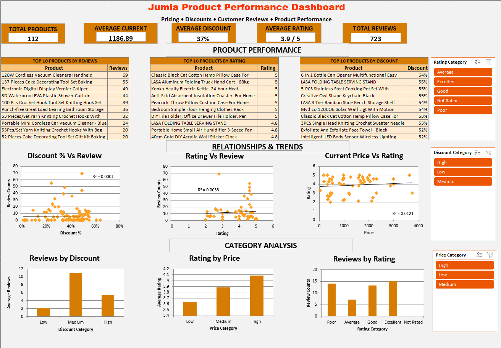

# Jumia Product Performance Dashboard

An Excel 2010/2021 data analysis and dashboard project that turns a raw export of Jumia product listings into a cleaned dataset, product-performance analysis, interactive charts and a seller-focused dashboard.

## Project overview

This project was completed from the DataEast Africa **Jumia Product Performance Dashboard** brief. The business problem is to understand how pricing, discounts and customer feedback relate to product performance and customer engagement.

Project brief: https://www.dataeast.africa/projects/jumia-product-performance-dashboard

The brief requires the analysis to:

- clean the raw export while preserving the original data;
- enrich the data with discount amount and product categories;
- calculate descriptive statistics;
- test relationships between discounts, reviews, ratings and prices;
- identify top-performing and underperforming product groups;
- build an interactive Excel dashboard with KPIs, top-10 tables, charts, category analysis and slicers; and
- document the findings and recommendations.

## Dataset

The original dataset contains **115 Jumia product listings** and six raw fields:

- Product
- Current price
- old price
- Discount
- Review
- Ratingd

The raw export contains text-formatted prices, discount percentages, negative review counts, ratings stored as text such as `4.6 out of 5`, missing values and duplicate rows.

## Workbook structure

The workbook is organised into separate analysis and presentation layers:

| Sheet | Purpose |
|---|---|
| `Dashboard` | Final visual dashboard |
| `Raw dataset` | Untouched original export |
| `Project Brief` | Business questions, audience and analysis requirements |
| `Cleaned data` | Cleaned and enriched dataset |
| `Cleaning log` | Cleaning decisions and validation notes |
| `Enrichment` | Add calculated columns |
| `Descriptive Stats` | Baseline KPIs and descriptive statistics |
| `Analysis Working` | Working analysis and filters |
| `Analysis Tables` | Etracted from Analysis Working |
| `pivot Charts` | Scatter plots and PivotCharts |
| `Pivot Tables` | Core PivotTables and ranking analyses |
| `Exceptions` | Outlier and exception groups |

## Data cleaning

### Duplicate handling

The raw export contained exact duplicate rows. Duplicate checking was performed before deletion. Excel's **Remove Duplicates** was applied to all six raw columns, removing **3 duplicate rows** and leaving **112 cleaned records**.

### Prices

Price values were converted from text into numbers. Currency symbols and thousands separators were removed. Where a source value was a range, the midpoint was used so the price could be represented numerically.

Example:

`KSh 1,620 - KSh 1,980` → **KSh 1,800**

### Reviews

Negative review counts were converted to positive whole numbers. Blank review counts were treated as **0 reviews** after validation.

### Ratings

Text values such as `4.6 out of 5` were converted to numeric ratings. Missing ratings remained blank rather than being converted to zero.

After cleaning:

- **57** listings had numeric ratings.
- **55** listings remained unrated.
- Minimum rating: **2.0**
- Maximum rating: **5.0**
- Average rating: **3.889474** (about **3.89/5**)

### Discount

The imported Discount column was already recognised by Excel as a numeric percentage, so no additional conversion was required.

## Data enrichment

### Discount Amount

`Discount Amount = Old Price - Current Price`

### Rating Category

The brief defines Poor, Average and Excellent bands but leaves a gap between 4.0 and 4.5. That gap was explicitly handled by adding a **Good** category.

| Rating | Category |
|---|---|
| Blank | Not Rated |
| < 3 | Poor |
| 3 to 4 | Average |
| > 4 to 4.5 | Good |
| > 4.5 | Excellent |

Final counts:

- Poor: **12**
- Average: **13**
- Good: **13**
- Excellent: **19**
- Not Rated: **55**

### Discount Category

- Low: **below 20%**
- Medium: **20% to 40%**
- High: **above 40%**

Final counts:

- Low: **18**
- Medium: **32**
- High: **62**

### Price Category

Price bands were based on current-price quartiles:

- Q1 = **KSh 493**
- Q3 = **KSh 1,669.50**

Therefore:

- Low: **<= KSh 493**
- Medium: **> KSh 493 and <= KSh 1,669.50**
- High: **> KSh 1,669.50**

Counts:

- Low: **28**
- Medium: **56**
- High: **28**

## Descriptive statistics

| Metric | Result |
|---|---:|
| Cleaned products | **112** |
| Rated products | **57** |
| Unrated products | **55** |
| Total reviews | **723** |
| Average current price | **KSh 1,186.89** |
| Average old price | **KSh 1,811.11** |
| Average discount | **about 36.8% (displayed as 37%)** |
| Average rating | **3.89 / 5** |
| Minimum current price | **KSh 38** |
| Maximum current price | **KSh 3,750** |

Most expensive product:

**32PCS Portable Cordless Drill Set With Cyclic Battery Drive -26 Variable Speed** — KSh 3,750.

Least expensive product:

**3PCS Single Head Knitting Crochet Sweater Needle Set** — KSh 38.

## Relationship analysis

### 1. Discount vs reviews

Correlation: **r = 0.0122**

R²: **0.00015**

The sample shows essentially **no linear relationship** between discount percentage and review count. A higher discount percentage did not correspond to a consistent increase in reviews.

The discount-category PivotTable reinforces this:

| Discount category | Products | Average reviews |
|---|---:|---:|
| Low | 18 | **2.11** |
| Medium | 32 | **10.97** |
| High | 62 | **5.39** |

This is not a simple increasing pattern. The Medium group has the highest average review count in this sample.

### 2. Rating vs reviews

Correlation: **r = 0.0572**

R²: **0.0033**

The relationship is very weak. Rating alone explains very little of the variation in review counts.

Average reviews by rating category were:

- Poor: **14.08**
- Average: **7.15**
- Good: **13.23**
- Excellent: **15.21**
- Not Rated: **0**

The category results do not form a simple monotonic pattern; higher review counts are not limited to the highest-rated products.

### 3. Current price vs rating

Correlation: **r = 0.1101**

R²: **0.0121**

There is a weak positive relationship, but it explains very little of the variation in ratings.

Average rating by price category:

| Price category | Average rating |
|---|---:|
| Low | **3.64** |
| Medium | **3.88** |
| High | **4.08** |

The category averages rise from Low to High, but the individual-level correlation remains weak.

## Product performance analysis

### Top 10 by reviews

1. 120W Cordless Vacuum Cleaners Handheld Electric Vacuum Cleaner — **69**
2. 137 Pieces Cake Decorating Tool Set Baking Supplies — **55**
3. Electronic Digital Display Vernier Caliper — **49**
4. 3D Waterproof EVA Plastic Shower Curtain 1.8*2Mtrs — **44**
5. 100 Pcs Crochet Hook Tool Set Knitting Hook Set With Box — **39**
6. Punch-free Great Load Bearing Bathroom Storage Rack Wall Shelf-White — **36**
7. 53 Pieces/Set Yarn Knitting Crochet Hooks With Bag - Pansies — **32**
8. Portable Mini Cordless Car Vacuum Cleaner - Blue — **24**
9. 52 Pieces Cake Decorating Tool Set Gift Kit Baking Supplies — **20**
10. 53Pcs/Set Yarn Knitting Crochet Hooks With Bag - Fortune Cat — **20**

### Top 10 by rating

Seven products recorded **5.0/5**, while three recorded **4.8/5**. The products include:

- Konka Healty Electric Kettle, 24-hour Heat Preservation, 1.5L, 800W, White — **5.0**
- Bedroom Simple Floor Hanging Clothes Rack Single Pole Hat Rack - White — **5.0**
- DIY File Folder, Office Drawer File Holder, Pen Holder, Desktop Storage Rack — **5.0**
- Classic Black Cat Cotton Hemp Pillow Case For Home Car — **5.0**
- Peacock Throw Pillow Cushion Case For Home Car — **5.0**
- Anti-Skid Absorbent Insulation Coaster For Home Office — **5.0**
- LASA Aluminum Folding Truck Hand Cart - 68kg Max — **5.0**
- LASA FOLDING TABLE SERVING STAND — **4.8**
- Portable Home Small Air Humidifier 3-Speed Fan - Green — **4.8**
- 40cm Gold DIY Acrylic Wall Sticker Clock — **4.8**

### Top 10 by discount

The final ranking uses discount percentage as the primary sort, with reviews used as the tie-breaker at the 52% cutoff.

1. 6 In 1 Bottle Can Opener Multifunctional Easy Opener — **64%**
2. Creative Owl Shape Keychain Black — **61%**
3. LASA FOLDING TABLE SERVING STAND — **55%**
4. 5-PCS Stainless Steel Cooking Pot Set With Steamed Slices — **55%**
5. Simple Metal Dog Art Sculpture Decoration For Home Office — **55%**
6. LASA 3 Tier Bamboo Shoe Bench Storage Shelf — **54%**
7. Mythco 120COB Solar Wall Light With Motion Sensor And Remote Control 3 Modes — **54%**
8. 3PCS Single Head Knitting Crochet Sweater Needle Set — **53%**
9. Classic Black Cat Cotton Hemp Pillow Case For Home Car — **53%**
10. Intelligent LED Body Sensor Wireless Lighting Night Light USB — **52%**

## Exception and outlier analysis

### High discount + poor rating

**10 products** have both a High Discount category and a Poor rating.

Examples include:

- 120W Cordless Vacuum Cleaner — 49% discount, 69 reviews, **2.8 rating**
- Intelligent LED Body Sensor Wireless Lighting Night Light USB — 52%, 15 reviews, **2.7**
- 5-PCS Stainless Steel Cooking Pot Set — 55%, 13 reviews, **2.1**
- Electric LED UV Mosquito Killer Lamp — 47%, 7 reviews, **2.1**
- Wall-mounted Sticker Punch-free Plug Fixer — 50%, 1 review, **2.0**

### High discount + little engagement

**32 products** have a High Discount and **0 reviews**.

This group is important because a large discount is present without observed customer engagement.

### Strong customer demand

Using the third quartile of review counts (**Q3 = 7**) as the threshold, **32 products** have **7 or more reviews** and are therefore classified as having strong customer demand for this analysis.

### Strong demand + average rating

**5 products** have both strong demand and an Average rating:

- 220V 60W Electric Soldering Iron Kits With Tools, Tips, And Multimeter — 15 reviews, 4.0
- 3PCS Single Head Knitting Crochet Sweater Needle Set — 13 reviews, 3.3
- 12 Litre Black Insulated Lunch Box — 13 reviews, 3.8
- Portable Wardrobe Nonwoven With 3 Hanging Rods And 6 Storage Shelves — 12 reviews, 3.8
- Mythco 120COB Solar Wall Light — 10 reviews, 3.0

### High price + poor rating

**2 products** fall into the High Price + Poor Rating group:

- 5-PCS Stainless Steel Cooking Pot Set — KSh 2,115, 55% discount, 13 reviews, 2.1 rating
- 5 Pieces/set Of Stainless Steel Induction Cooker Pots — KSh 2,170, 13% discount, 6 reviews, 2.5 rating

## Answers to the business questions

### Are higher discounts leading to higher customer engagement?

Not in this sample. The discount-versus-reviews correlation is **0.0122** with R² of **0.00015**, indicating essentially no linear relationship. The category results also do not rise consistently from Low to Medium to High discount levels.

### Do highly rated products have higher or lower prices?

There is a weak positive relationship between current price and rating (**r = 0.1101, R² = 0.0121**). High-price products had a higher average rating than low-price products in the category analysis (4.08 vs 3.64), but price explains little of the individual variation in rating.

### Which products are performing best, and which need a better pricing strategy?

Performance depends on the metric used:

- **Engagement:** the highest review counts are concentrated in the Top 10 by Reviews.
- **Customer rating:** the Top 10 by Rating contain seven 5.0-rated products and three 4.8-rated products.
- **Pricing/promotion attention:** the High Discount + Poor Rating group contains 10 products, while the High Discount + Little Engagement group contains 32 products.
- **Value/price attention:** two high-price products also have poor ratings.

The analysis therefore avoids treating one metric as a universal measure of product performance.

## Three recommendations for Jumia sellers

### 1. Do not assume a deeper discount will automatically create more engagement

The sample shows almost no linear relationship between discount percentage and review count (r = 0.0122). Average reviews were actually highest in the Medium discount category (10.97), compared with 5.39 in High and 2.11 in Low.

**Action:** test pricing and promotional levels by product rather than applying deeper discounts across the board, and monitor reviews and conversion-related indicators after each change.

### 2. Investigate product quality and customer experience before increasing discounts on poorly rated products

Ten products have both High Discount and Poor Rating. For example, the 120W Cordless Vacuum has a 49% discount, 69 reviews and a 2.8 rating, while the 5-PCS Stainless Steel Cooking Pot Set has a 55% discount, 13 reviews and a 2.1 rating.

**Action:** review complaints, product specifications, images, fulfilment issues and customer feedback before using additional price reductions to stimulate demand.

### 3. Use product-level price-value analysis instead of assuming expensive products are rated better

The price-rating relationship is weak (r = 0.1101). Although High Price products averaged 4.08 compared with 3.64 for Low Price products, two high-price products also had poor ratings.

**Action:** review price competitiveness together with rating, reviews and customer feedback, and use bundles, product improvements or clearer value communication where appropriate instead of relying on price changes alone.

## Limitations

- The dataset contains only **112 cleaned listings**, so findings describe this sample and should not be treated as a universal statement about all Jumia products.
- Correlation measures association, not causation.
- Review count is an engagement proxy and does not capture impressions, clicks, conversion rate or sales revenue.
- Missing ratings were retained as Not Rated rather than imputed.
- Product titles can repeat, which is why a Listing ID was used in analytical PivotTables where necessary.

## Dashboard

The final dashboard includes:

- five KPI cards;
- three Top-10 summary tables;
- three relationship scatter plots;
- three category PivotCharts;
- Rating Category, Discount Category and Price Category slicers; and
- orange/neutral Jumia-inspired styling with conditional formatting for key extremes.



## Dev.to article

[Building an Interactive Excel Dashboard for E-commerce Product Analysis: A Case Study of Jumia Products](https://dev.to/jason_ndalamia/building-an-interactive-excel-dashboard-for-e-commerce-product-analysis-a-case-study-of-jumia-106e)

## Repository structure

```text
Jumia-Product-Performance-Dashboard/
│
├── README.md
├── Jumia_Product_Performance_Dashboard.xlsx
└── screenshots/
    ├── 01-raw-data.png
    ├── 02-cleaned-data.png
    ├── 03-formulas-enrichment.png
    ├── 04-pivot-tables.png
    ├── 05-scatter-plots.png
    ├── 06-pivot-charts.png
    └── dashboard.png
```

## Project source

DataEast Africa — Jumia Product Performance Dashboard:
https://www.dataeast.africa/projects/jumia-product-performance-dashboard
